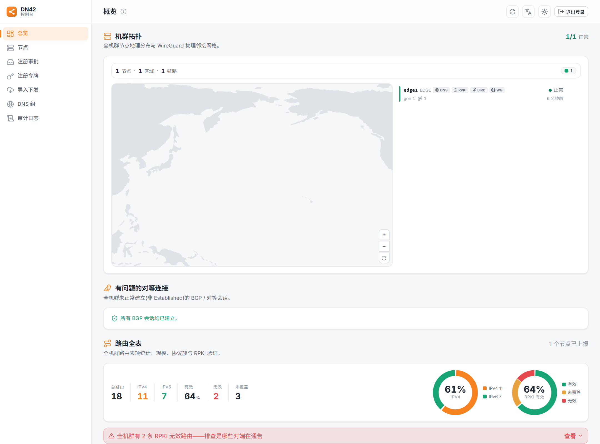
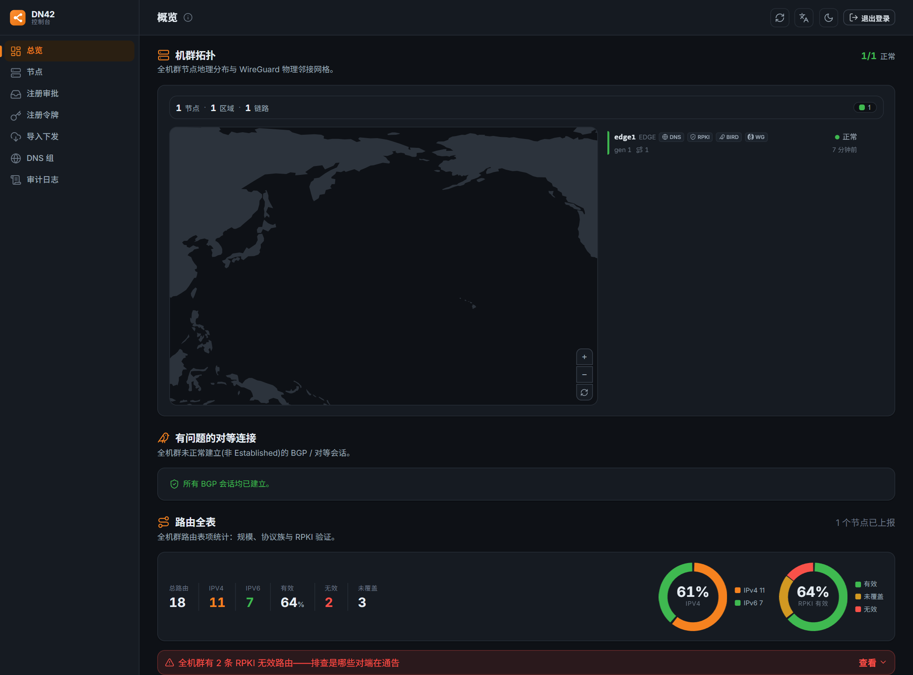
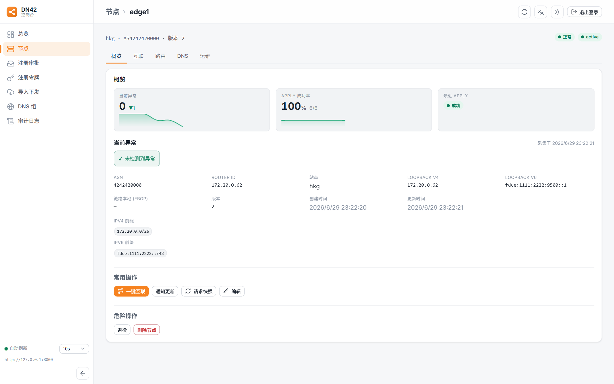
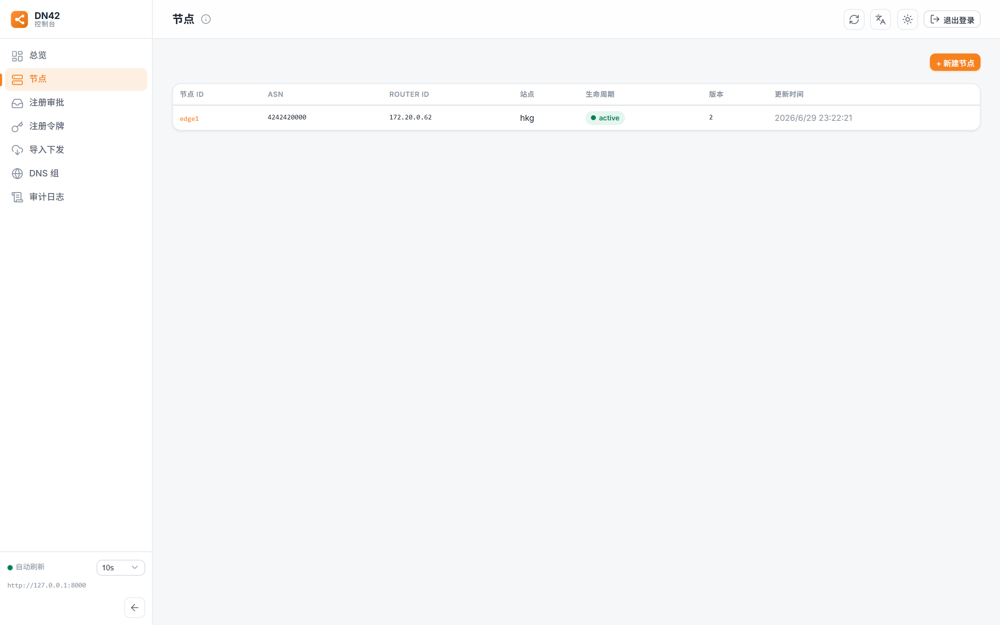
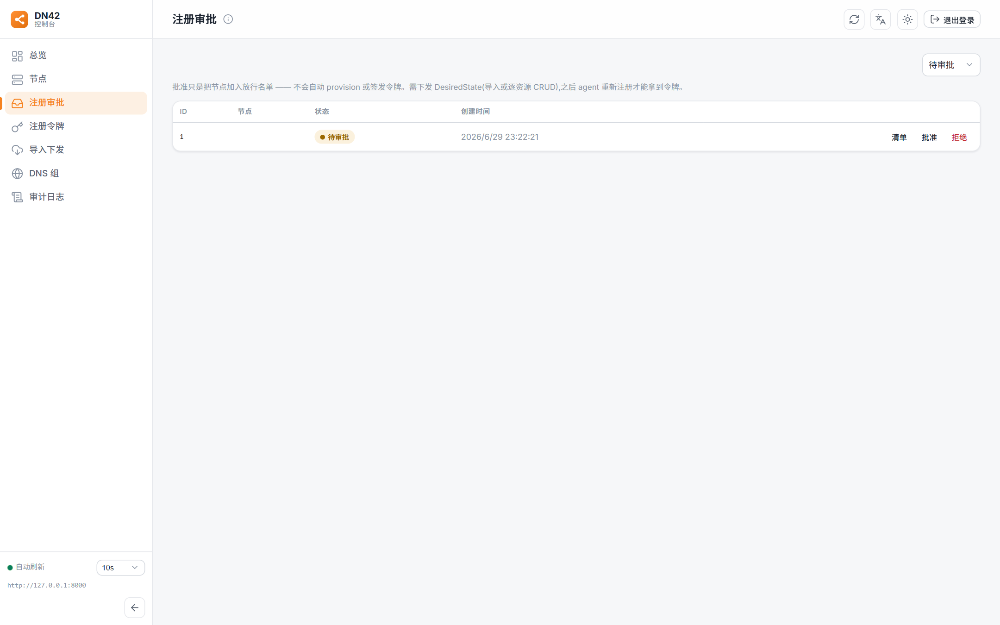
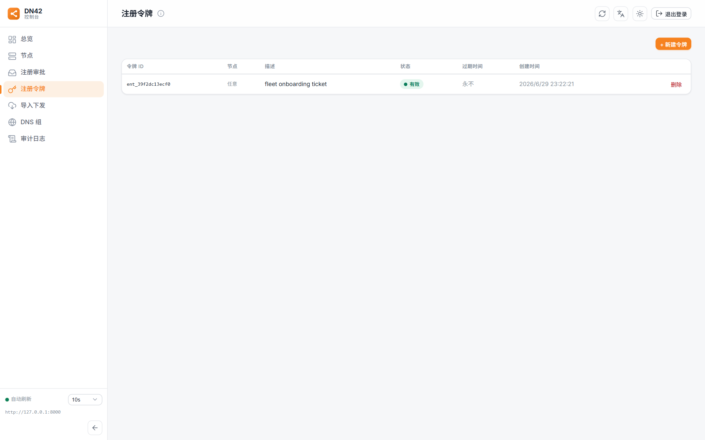
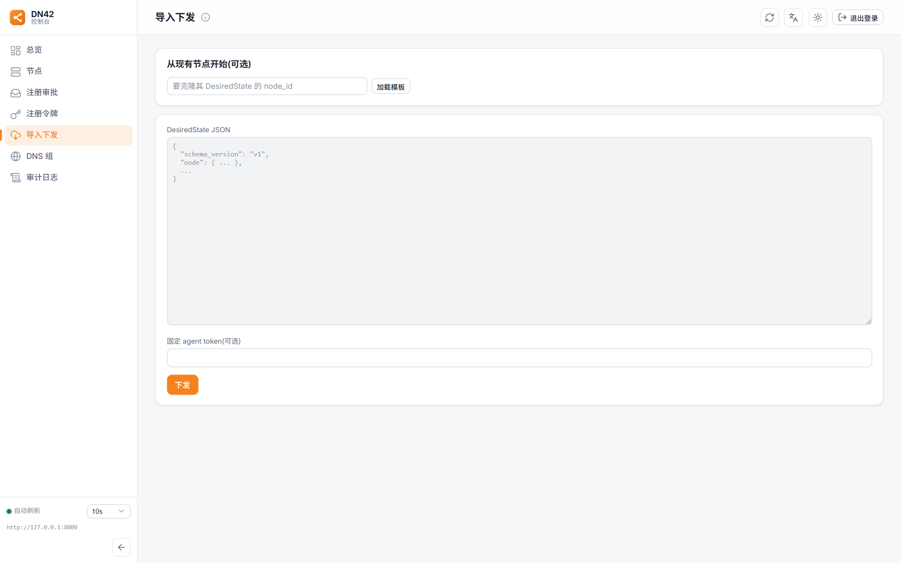
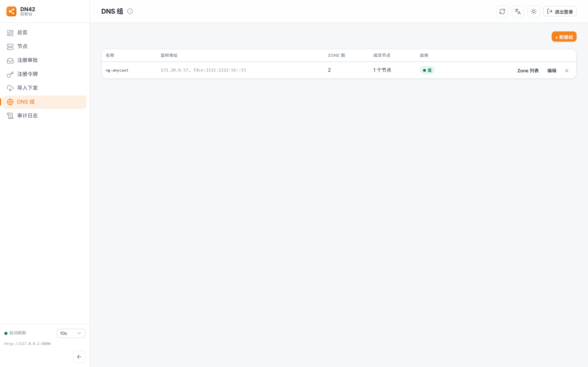
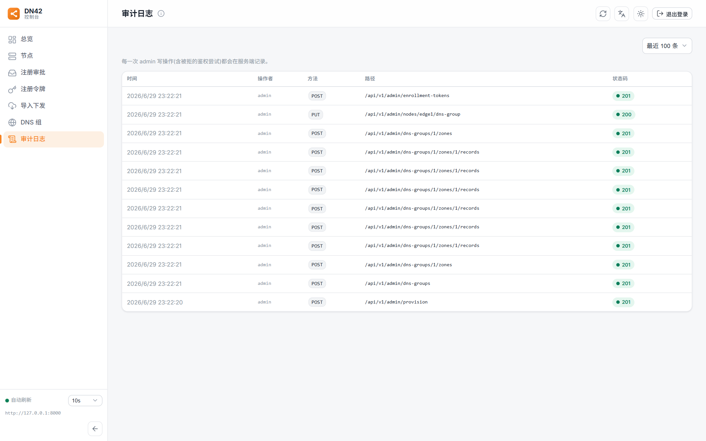

# DN42 Control Web UI

[](LICENSE)
[](https://kit.svelte.dev/)
[](https://svelte.dev/)

DN42 控制平面的 **管理 Web 控制台**：基于 SvelteKit（`adapter-static`）的纯客户端 SPA，独立静态托管，通过 CORS + Bearer Token 直连
[`dn42-control-backend`](https://github.com/chidakiko/dn42-control-backend) 的 Admin API。

控制台把"节点应该跑什么配置"这件事做成可视化闭环：在浏览器里管理节点、peering、BGP 会话、路由策略、DNS 与令牌，
后端合成新的 `DesiredState` 并摇门铃，节点 Agent 拉取、渲染、对账、回报——控制台再把健康、路由、漂移、流量观测渲染出来。

> 安全模型：控制台本身 **不持有任何密钥**。Admin token 只存在于浏览器 `localStorage`，以 `Authorization: Bearer` 直连后端；
> 控制面不提供远程 shell 或任意命令执行接口。

<p align="center">
  
</p>

## 功能一览

| 模块 | 说明 |
| --- | --- |
| **机群概览** | 节点地理分布 + WireGuard 邻接拓扑（可缩放/区域聚合）、异常 BGP 会话、全机群路由全表（规模 / 协议族 / RPKI 验证 + Top 起源 AS）、流量趋势。 |
| **节点详情** | 单节点的概览 / 互联 / 路由 / DNS / 运维多页签：健康与 apply 成功率、当前漂移、地址与前缀、generation 历史、内部拓扑、自监控指标。 |
| **一键互联向导** | 引导式 peer 表单，地址单一真相源（本端 LL 自动派生、对端只填一次、复用节点钥），免手填原始 JSON。 |
| **路由调优** | 三件套表单生成路由策略，无需手写策略 JSON。 |
| **注册审批 / 注册令牌** | 节点注册放行名单审批、enrollment token 的签发与管理。 |
| **导入下发（Provision）** | 直接粘贴 / 从现有节点克隆 `DesiredState` JSON 整节点灌入。 |
| **DNS 组与 Anycast** | DNS 组、zone、record 管理与节点订阅。 |
| **审计日志** | 管理动作审计流水。 |
| **体验** | 中 / 繁中 / 日 / 英四语 i18n、亮 / 暗 / 跟随系统三档主题、骨架屏防跳动、可收缩侧栏、登录前防白闪。 |

## 截图

| 机群概览（暗色） | 节点详情 |
| :---: | :---: |
| [](docs/screenshots/dashboard-hero-dark.png) | [](docs/screenshots/node-detail.png) |
| **节点列表** | **注册审批** |
| [](docs/screenshots/nodes.png) | [](docs/screenshots/registrations.png) |
| **注册令牌** | **导入下发** |
| [](docs/screenshots/enrollment-tokens.png) | [](docs/screenshots/provision.png) |
| **DNS 组** | **审计日志** |
| [](docs/screenshots/dns-groups.png) | [](docs/screenshots/audit.png) |

## 技术栈

- **SvelteKit 2** + **Svelte 5（runes 模式）** + **TypeScript**
- **`adapter-static`** —— `ssr=false` / `prerender=false`，纯客户端 SPA，所有路由经 `index.html` 回退
- **bits-ui**（无样式组件原语）、**Chart.js**（趋势 / 环形图 / 火花线）、**Inter** 可变字体
- **Vite 8**

## 快速开始

需要 Node.js（建议 20+）。

```bash
npm install
npm run dev      # 开发服务器： http://127.0.0.1:5173
npm run build    # 产物输出到 build/（纯静态站）
npm run preview  # 本地预览构建产物
npm run check    # svelte-check 类型检查
```

控制台需要一个运行中的 [`dn42-control-backend`](https://github.com/chidakiko/dn42-control-backend) 才能登录。
后端最简起法（`uvicorn + SQLite`，自带 demo 节点）见其仓库的快速上手文档。

## 配置

控制服务器地址有两个来源，**运行时覆盖优先**：

| 方式 | 说明 |
| --- | --- |
| 登录页 "控制服务器地址" 输入框 | 运行时填写，存入 `localStorage`。同一份静态产物可指向不同机群。 |
| 构建期环境变量 `VITE_CONTROL_API` | 作为默认值烘焙进产物（不填则默认 `http://127.0.0.1:8000`）。 |

登录后，admin token 同样存于浏览器 `localStorage`（键 `dn42.admin.token`），每次请求以 `Authorization: Bearer` 发送。

## 部署

构建产物是 `build/` 下的纯静态文件，用任意静态服务器（nginx / Caddy / Cloudflare Pages 等）托管即可。两点要注意：

1. **SPA 回退**：这是纯客户端路由的 SPA，所有未知路径都要回退到 `index.html`（HTTP 200），否则刷新子路由会 404。
   - nginx：`try_files $uri $uri/ /index.html;`
   - Cloudflare Pages：仓库已含 [`static/_redirects`](static/_redirects)（`/*  /index.html  200`）。
2. **CORS**：后端需把本控制台的来源加入 `DN42_CONTROL_CORS_ORIGINS`（逗号分隔，或 `*`），浏览器才能跨域直连 Admin API。

## 国际化与主题

- 语言：简体中文 / 繁体中文 / 日本語 / English，顶栏一键切换，存 `dn42.locale`。
- 主题：亮 / 暗 / 跟随系统三档，存 `dn42.theme`。

## 许可证

[GPL-3.0](LICENSE)。
